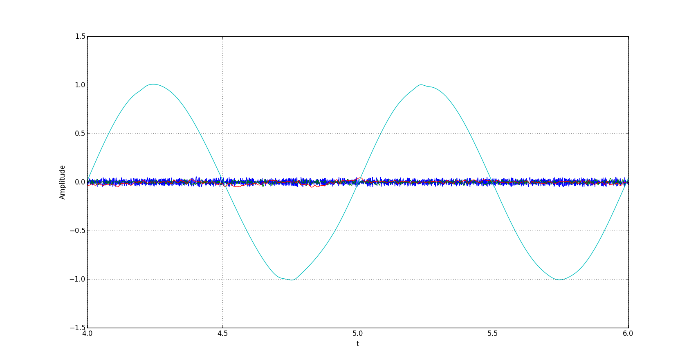

# EMD = Empirical Mode Decomposition 

## Description

[EMD](http://rspa.royalsocietypublishing.org/content/royprsa/454/1971/903.full.pdf) is a method for analysing non-stationary and nonlinear data. 
I'm going to tell you main things about EMD:
- Method is locally adaptive, data-driven, multiscale, high efficient. 
- The user specifies the number of mod. 
- Fast oscillations superimposed to slow oscillations 
(First mode = fast oscillations = high frequency. Last mode = slow oscillations = low frequency).  
- Many applications to speech analysis (biological data, astronomical data, nonlinear physics data, earthquake, climate, etc.).

## Motivation

## Test Data

We are going to use noise sinus:
```python
	noise = random.uniform(-0.05,0.05,10000)
	signal = sin(2*pi*f*t) + noise
```


## Results

If number of mod = 2


If number of mod = 4




Result EMD for Van der Pol oscillator. The number of mod = 4.


## Learn more

- [Wiki EMD](https://en.wikipedia.org/wiki/Hilbert%E2%80%93Huang_transform#Empirical_mode_decomposition_(EMD))
- [scipy.interpolate.splrep](https://docs.scipy.org/doc/scipy/reference/generated/scipy.interpolate.splrep.html)
- [scipy.interpolate.splev](https://docs.scipy.org/doc/scipy/reference/generated/scipy.interpolate.splev.html)

< I'm going to add some useful links lately...


## Installation

You can use [Python](https://www.python.org/) with data package: [Anaconda](https://www.anaconda.com/) or [Miniconda](https://conda.io/miniconda).
There's another way - use [Portable Python](http://portablepython.com/). Also you can use whatever IDE for Python.

## License

Free
